## 前言

本文主要介绍下医院预约挂号小程序项目的技术架构及主要功能描述。

项目结构：

hosp-admin	

|- hosp-admin	医院小程序管理--后台服务

|- hosp-web	医院小程序管理--web后台管理

|- hosp-app	医院小程序管理--小程序/H5

项目扩展性强，可快速实现与HIS及已有系统对接。 

获取源码及业务交流请联系：

QQ：814483194（添加备注：预约挂号）

邮箱：whwtree@163.com

个人站地址：
https://whwtree.com/archives/hospital-appointment.html

## 技术架构

本项目使用前后端分离的架构，主要使用的技术：

后端技术：

SpringBoot + Spring Security + JWT + MySQL

前端技术：

Vue + Element UI + uni-app

## 主要功能

本项目主要实现的是医院在线预约挂号的功能，主要功能包括：
- 小程序-微信小程序登录流程；
- 小程序-就诊人信息管理；
- 小程序-按医生/科室预约挂号；
- 小程序-预约挂号订单微信支付及支付结果回调；
- 小程序-预约挂号记录查询；
- 小程序-预约挂号退号及退款操作；
- 小程序-预约挂号订单同步HIS；
- 小程序-意见及问题反馈；
- 管理后台-预约挂号医院、科室、医师信息管理；
- 管理后台-医师排班管理（支持上/下午、全天，分时段排班设置）；
- 管理后台-预约挂号结果查询（支持微信支付、退款及HIS数据同步）；

## 小程序页面截图

<table>
    <tr>
        <td class='miniapp'></td>
        <td class='miniapp'>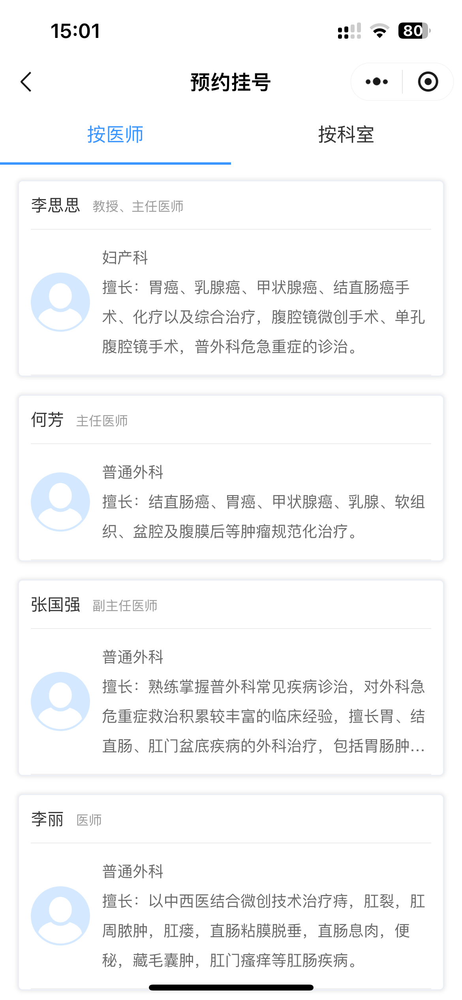</td>
    </tr>
	<tr>
        <td>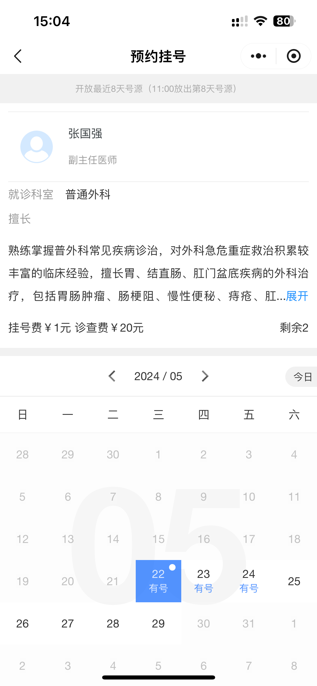</td>
		<td>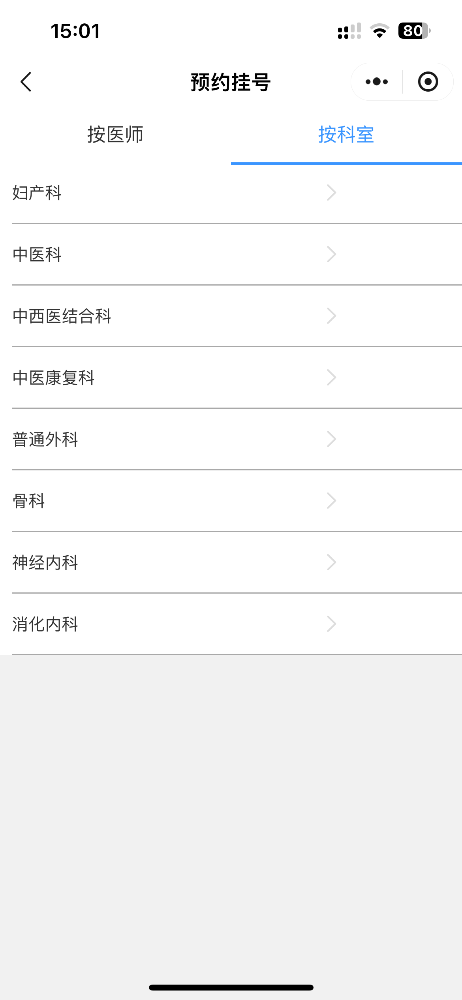</td>
    </tr>
	<tr>
        <td>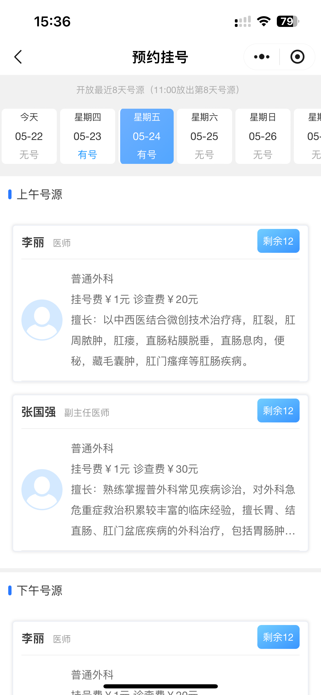</td>
        <td>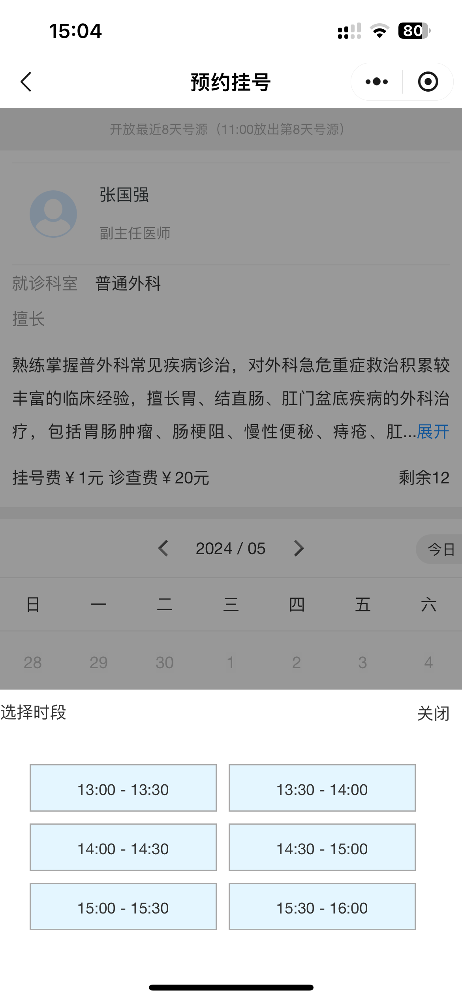</td>
    </tr>
	<tr>
        <td>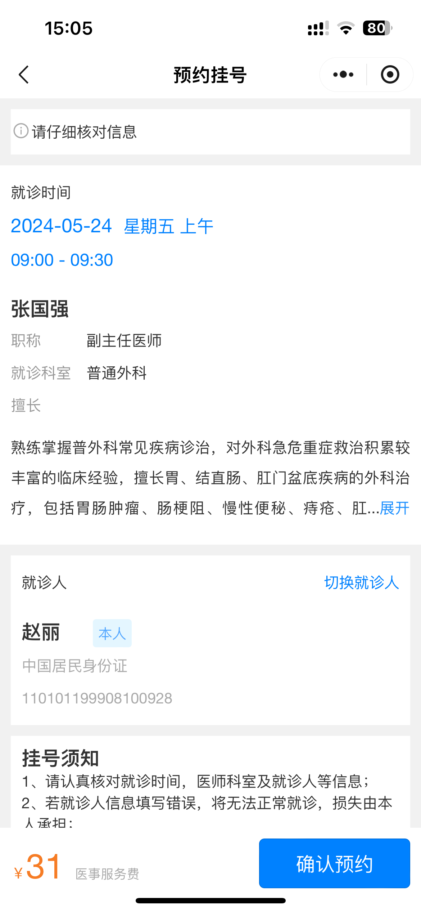</td>
        <td>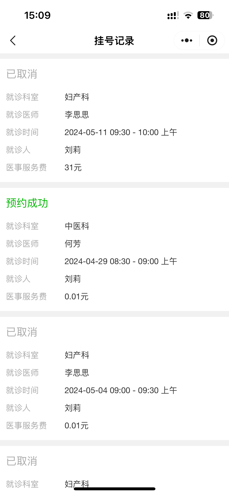</td>
    </tr>
	<tr>
        <td>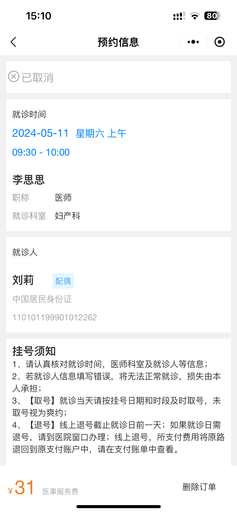</td>
        <td></td>
    </tr>
	<tr>
        <td>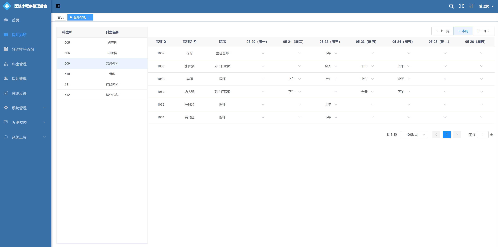</td>
		<td>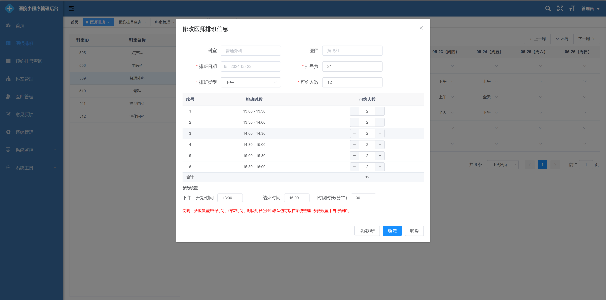</td>
    </tr>
	<tr>
        <td>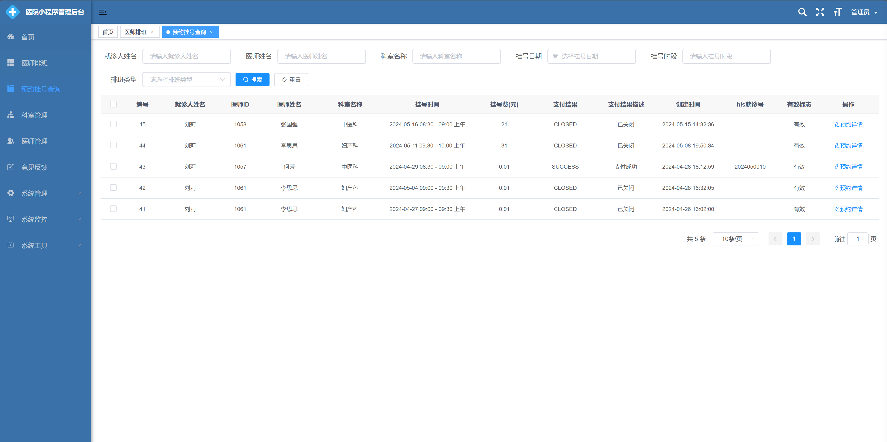</td>
		<td></td>
    </tr>
</table>

